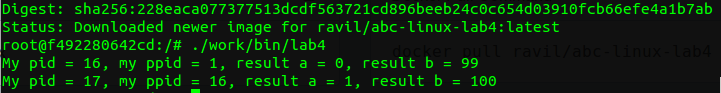

Лабораторная-работа-1
=====================

Цель работы
-----------

#. Приобретение навыков по управлению процессами.
#. Изучение системного вызова fork().
#. Приобретение навыков написания и трансляции системного ПО на языке C.
#. Изучение утилиты make и ее использование для трансляции программ на языке C.
#. Использование удаленных серверов для трансляции приложений.

Выполнение работы
-----------------

Запуск **DOCKER-контейнера** из образа ubuntu 14.04 в интерактивном режиме

.. code-block:: bash
   :emphasize-lines: 1

   sudo docker run -it --rm --name lab4 ubuntu:14.04

В контейнере создаем каталог work и переходим в него.

.. code-block:: bash
    :emphasize-lines: 1-2

    mkdir work
    cd /work 
  
Для выполнения работы неоднобимо установить недостающие компаненты: 

**Компилятор gcc**

.. code-block:: bash
   :emphasize-lines: 1

   apt-get install gcc

**Редактор nano**

.. code-block:: bash
   :emphasize-lines: 1

   apt-get install nano

**Утилита make**

.. code-block:: bash
   :emphasize-lines: 1

   apt-get install make

**SSH клиент**

.. code-block:: bash
   :emphasize-lines: 1

   apt-get install -y openshh-clients

В лабораторной работе используются файлы, хранящиеся на сервере лаборатории. Скопирум данные файлы в контенейр выполнив команду:

.. code-block:: bash
   :emphasize-lines: 1

   scp -r -P 6666 student@openit.guap.ru:/container/ABC-Linux/lab4/* work/

Просмотреть исправленные файлы возможно, перейдя по ссылкe_.

.. _ссылкe: https://github.com/Ishkinin/abc_Linux_labs/tree/master/lab4

Запуск отранслированной программы

.. code-block:: bash
   :emphasize-lines: 1

   ./work/bin/lab4

Теперь сохраняем наш контейнер и заливаем и его на dockerhub_.

.. _dockerhub: https://hub.docker.com/r/ravil/abc-linux-lab4/
  
Команды:
 
.. code-block:: bash
   :emphasize-lines: 1-2

   docker commit lab4
   docker push lab4 ravil/abc-linux-lab4

Выводы
------

#. Приобрел навыки управления процессами.
#. Благодаря технологии контейнеров имеется возможность запуска процессов визолированном окружении абсолютно под разными операционными системами.
#. Приобрел навыки управления процессами и навыки написания и перевода системного программного обеспечения на языке C.
#. Изучил утилиту make и ее использование для перевода программ.
#. И обнаружил что не всегда getppid() возвращает номер породившего процесса.

